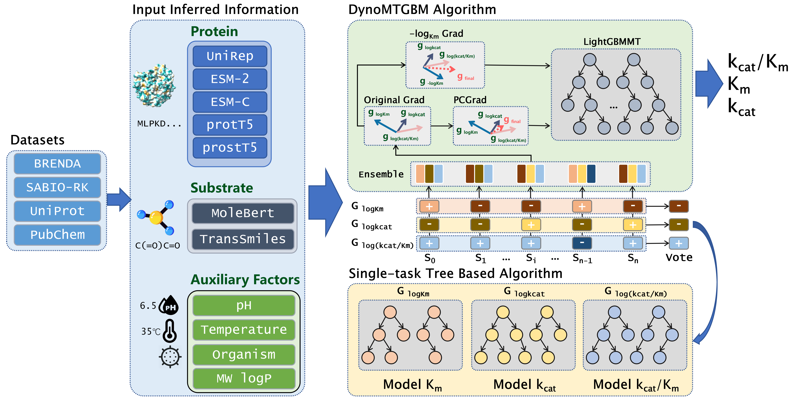

# DynoMTGBM 🚀

A gradient boosting-based multi-task regression framework (DynoMTGBM) was developed, demonstrating superior performance in both single-task and multi-task prediction settings. This framework simultaneously predicts enzyme kinetic parameters: $k_{cat}$, $K_m$, and $k_{cat}/K_m$. It incorporates pretrained representations of both enzyme and substrate, as well as environmental factors such as pH and temperature, mutation types, and organism metadata.

---


---


## 🌟 Key Features
- 📊 **Comprehensive dataset**: 46,936 enzyme kinetic samples, each labeled with $K_m$, $k_{cat}$, and $k_{cat}/K_m$, along with corresponding pH, temperature, and organism.
- 🚀 **DynoMTGBM framework**: Gradient boosting-based multi-task regressor achieving superior results in both single-task and multi-task scenarios.
- 🔁 **Task relationship optimization**: Introduced $-\log K_m$ reparameterization to reduce task interference and enhance stability.

---

## 📁 Project Structure

```
DynoMTGBM_main/
├── data_process/                   # Dataset loading, preprocessing
│   │── dataset/                    # Place df_multi_tasks.json here
│   └── inferred_functions/         # Unzip and place pre-trained models here
├── embeddings_ablation/            # Studies of different enzyme/substrate embeddings
├── envir_factors_ablation/         # Effect of temperature, pH, etc.
├── kcatkm_base_models_compare/     # Comparison with baseline models (e.g., XGBoost, LightGBM, 1D-CNN)
├── kcatkm_mtgbm_ablation/          # Ablation study of multi-task boosting tasks and structure
├── kinetic_params_evaluate/        # Performance compare with UniKP, MPEK
└── requirements/                   # dynomtgbm.yaml and requirements.txt
```


---

## 📦 Installation

### 🔧 LightGBMMT Installation (Required)

```bash
# download zip file from https://github.com/antmachineintelligence/mtgbmcode
# activate your python environment
sudo unzip mtgbmcode-main.zip
cd mtgbmcode-main/python-package/
python setup.py install
```

### 📌 Option 1: Manual Installation

```bash
conda create -n DynoMTGBM python=3.8 -y
conda activate DynoMTGBM
conda install pytorch torchvision torchaudio cudatoolkit=11.3 -c pytorch -y
pip install transformers pandas matplotlib hyperopt xlrd==1.2.0 openpyxl scikit-learn torch-geometric==2.1.0 rdkit xgboost==2.1.3 scikit-learn-intelex SentencePiece
conda install -c pyg pytorch-sparse
```

### 📌 Option 2: Environment File Installation

```bash
cd requirements/
conda env create -f dynomtgbm.yaml
pip install -r requirements.txt
```

---

## 📂 Dataset Preparation

Download from [HuggingFace Dataset](https://huggingface.co/datasets/chengmingji/DynoMTGBM_download_dataset/tree/main)

Put the following file into the correct folder:

```
df_multi_tasks.json → data_process/dataset/
```

---

## ✒️ Authors

- Chengming Ji  
- Zixin Chen  
- Zeming Liu  
- Huanliang Xu  
- Zhongli Cui *(Corresponding author)*  
- Junxian Huang *(Corresponding author)*  

---

## 📄 License

This project is licensed under the MIT License.
